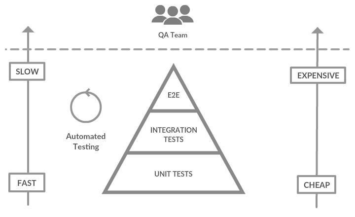

import { Head, Notes, Appear, Image } from "mdx-deck";

export { future as theme } from "mdx-deck/themes";

<Head>
  <title>Software Testing and You ♥️</title>
</Head>

## Software Testing and You ♥

---

# What is testing? 🤔

Testing is the practice of writing _extra_ code that checks whether our functional code works as intended

---

# Why does it matter?

<ul>
  <Appear>
    <li>Tests ensure our product meets certain quality standard</li>
    <li>
      Tests let us know whether a change we introduced in our code breaks
      existing functionality
    </li>
    <li>Corollary: Tests covered code is easier to refactor!</li>
    <li>Tests let us detect errors early in the development cycle</li>
    <li>Tests are documentation!</li>
  </Appear>
</ul>

<Notes>
  - "Easier to refactor" > As long as we keep the API consistent, we can
  refactor the implementation with confidence of not breaking things
</Notes>

---

# But... 😔

---

# Tests are not _free_

- Tests are additional code
- We invest time in writing them
- We invest time in maintaining them
- Some tests might be hard to write!

---

## Tests should run as part of your CI/CD pipeline

- Get immediate feedback when tests are failing
- Avoid merging code that breaks the build

<Notes>
  Related to what we said about "Tests let us detect errors early in the
  development cycle"
</Notes>

---

# Different types of tests

<Notes>
  There are a lot of different types of test depending on what you are testing
  and how you are testing it. Most common ones: Unit tests, Integration tests,
  e2e tests (also called UI tests)
</Notes>

---

## Unit testing

Testing of a _unit_ of code in isolation of other _units_

---

## Integration testing

Testing how different _parts_ of our system interact with eachother

---

## UI/e2e testing

Also called automated browser testing. In web applications, an e2e test will spin up
you app and will interact with it as if it were an user, making sure the tested scenario works as intended

---

# Testing Pyramid

---

---

# Why is it a pyramid?

# 🤔

<Notes>
  The idea here is that the close to the base of the pyramid you are, the more
  of that kind of test you should have in your app. So ideally you should have a
  lot of unit tests, some integration tests and a few UI tests.
</Notes>

---

## There are a couple of reasons for this

- Unit tests are **easier** to write and **faster** to execute
- UI tests are **harder** to write and **slower** to execute

<Notes>
  - Unit tests are usually easier to write and faster to run and a failing unit
  test will tell you exactly what's failing - UI tests are harder to write and
  much more expensive to run (you need to spin up your whole app and execute
  them)
</Notes>

---

# Unit testing ✅

---

# What's an _unit_ test?

<ul>
  <Appear>
    <li>
      There is no formal definition of what a <b>unit</b> is
    </li>
    <li>
      We can say that a <b>unit</b> is an <b>atomic</b> piece of code that you
      want to test
    </li>
    <li>
      A <b>unit</b> test will test a <b>unit</b> in <b>isolation</b> of other{" "}
      <b>units</b>
    </li>
    <li>
      Most of the dependencies or collaborators of the <b>unit</b> will be{" "}
      <b>mocked</b>
    </li>
  </Appear>
</ul>

---

## Mocking

- Replacing an external dependency of your _unit_ with a fake versions of it that acts like the real thing
  but responds with fixed responses that you can define at the beginning of your test
- You need to be able to control how these dependencies behave in order to create a specific scenario to test
- Most testing frameworks provide an easy way to set up mocks

---

## What to test?

- Only test the public API
- Tests should not reflect implementation details
  - Test **what**, not **how**
- Test non-happy paths & edge cases
- Use your common sense
  - Test scenarios that add value to your test suite
    - Code that is highly likely to change
    - **Core** functionality
  - There is no need to test trivial code! (i.e. getter/setters)

---

## Coverage 📊

- Metric that informs how much percentage of our code is covered by automated tests
- How much coverage should we aim for? Depends!
- 100% coverage? 🤔
  - 100% coverage doesn't mean your code is failproof
  - If you aim for 100% coverage you'll end up testing trivial code
  - Waste of time
- Martin Fowler says: "Use coverage as a tool to find untested code"

---

# TDD

---

## What is it?

- _Test-Driven Development_ is a technique for building software
- Instead of writing code first and then the tests, we start by writing the tests (even if there is technically no code to test 🤔)
- These test will define what our component should and shouldn't do

---

## Why TDD? 🤔

- Writing tests first let you focus on the API rather than the implementation
  - Tends to produces components with better APIs
- Avoid bias when writing tests
  - If you wrote the implementation first you know how it works and what to test/what not to (?)

<Notes>TDD good for better APIs</Notes>

---

## How to do TDD

According to Martin Fowler you should follow these 3 steps:

<ul>
  <Appear>
    <li>Write a test for the next bit of functionality you want to add</li>
    <li>️Write the functional code until the test passes</li>
    <li>Refactor both new and old code to make it well structured</li>
  </Appear>
</ul>

---

# Next Session 🤓

- Unit testing in JS with Jest
- Unit testing _React_ components with Jest + Enzyme

---

## Further reading

- Martin Fowler website
  - <https://martinfowler.com/articles/practical-test-pyramid.html>
  - <https://martinfowler.com/bliki/TestDrivenDevelopment.html>
  - <https://martinfowler.com/bliki/TestCoverage.html>
  - <https://martinfowler.com/bliki/TestPyramid.html>
